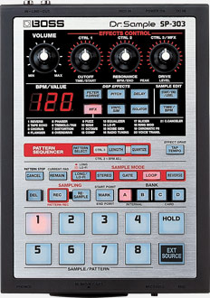


Witaj w świecie mobilnej produkcji muzycznej! Zanim zaczniesz tworzyć swoje pierwsze bity, musisz poznać podstawowe narzędzie naszej pracy – aplikację Koala Sampler.


## Co to jest Koala Sampler?
Koala Sampler to potężny, ale niezwykle intuicyjny, kieszonkowy sampler, sekwencer i mikser. Aplikacja jest dostępna na urządzenia z systemem iOS i Android, a także na komputery Mac. 

Jej twórcy inspirowali się klasycznymi samplerami sprzętowymi, takimi jak Boss SP-303 (kultowy sprzęt używany m.in. przez legendarnego producenta J Dillę).

Koala Sampler pozwala na natychmiastowe nagrywanie dźwięków przez wbudowany mikrofon telefonu, ładowanie gotowych sampli (nawet z plików wideo!), cięcie ich, nakładanie efektów i tworzenie całych utworów muzycznych.

## Niski próg, wysoki sufit (Low Floor, High Ceiling)
Wybraliśmy Koala Sampler na warsztaty Music Dojo, ponieważ idealnie ucieleśnia filozofię **"low floor, high ceiling"**. Możesz zacząć tworzyć swój pierwszy bit w zaledwie 5 minut, a jednocześnie aplikacja jest na tyle potężna, by stworzyć w niej gotowy, profesjonalny utwór. 

Dowodem na to jest **[Marek Mensa (marrson)](https://www.marrson.com/)** – olimpijczyk w breakingu, który stworzył pełnowymiarowy album z bitami, używając *wyłącznie* telefonu i Koala Sampler podczas swoich podróży po świecie.



## Jak ściągnąć aplikację?
Podstawowa wersja aplikacji kosztuje **24,99 zł**.

*   **iOS:** [Pobierz w App Store](https://apps.apple.com/us/app/koala-sampler-beat-maker/id1449584007)
*   **Android:** [Pobierz w Google Play Store](https://play.google.com/store/apps/details?id=com.elf.koalasampler)

Istnieje również [wersja na Windows](https://www.elf-audio.com/koala/win.php), jednak sam autor określa ją jako "rough port" (uproszczony port), więc nie oferuje ona tak płynnego doświadczenia jak wersje mobilne.

## Moduły rozszerzające (In-App Purchases) – co można dokupić?
Do udziału w naszych warsztatach w zupełności wystarczy podstawowa wersja aplikacji. Można w niej jednak dokupić dodatki, które rozszerzają jej możliwości:

### 1. Samurai Edition (19,99 zł)
To rozszerzenie wprowadzające zaawansowane narzędzia edycyjne i produkcyjne.
*   **Co zawiera?** Zaawansowany Timestretch (4 algorytmy rozciągania w czasie bez zmiany wysokości dźwięku), edytor Piano Roll, Auto-Chop (automatyczne cięcie sampli na równe kawałki lub według uderzeń), 3-pasmowy korektor (EQ), wbudowany syntezator "Quokka" oraz obsługę wyjścia MIDI.
*   **Dla kogo?** Dla osób poszukujących bardziej zaawansowanych narzędzi. Przydaje się, jeśli zależy Ci na szybkim i dokładnym cięciu długich sampli, chcesz programować melodie w edytorze sekwencji lub planujesz sterować zewnętrznym sprzętem MIDI.

### 2. The Mixer (Mikser) (24,99 zł)
Rozszerzenie, które zamienia Koalę w miniaturowe studio mikserskie.
*   **Co zawiera?** Dodaje 4 podgrupy (szyny/buses) oraz kanał Master. Każdy z kanałów posiada 5 slotów na efekty, które możesz swobodnie układać w łańcuchy (np. kompresor, reverb, przester itp.).
*   **Dla kogo?** Dla osób, którym zależy na zaawansowanym projektowaniu dźwięku i profesjonalnie brzmiącym miksie.

### 3. Pakiety sampli (po 14,99 zł każdy)
Jeśli szukasz świeżych brzmień na start, możesz dokupić profesjonalnie przygotowane paczki:
*   Solar Studies Samplepack
*   Cirrus Cuts Sample Pack
*   Analog Astronaut Samplepack
*   Soon Come Dub Sample Pack

## Słów kilka o zespole deweloperskim i samym projekcie
Za aplikacją stoi "elf audio" – firma deweloperska prowadzona przez Marka Berezę. Koala to fantastyczny projekt, który zyskał ogromne uznanie w środowisku beatmakerów – od amatorów w sypialniach po uznanych artystów z branży. 

Główną filozofią dewelopera było stworzenie instrumentu, w którym nie ma "pedału hamulca". Interfejs ma Cię utrzymać w ciągłym procesie twórczym ("flow"), bez gubienia się w niekończących się menu i mikrozarządzaniu nutami. W Koali tworzysz błyskawicznie – podejmujesz decyzje, nakładasz efekty i po prostu idziesz dalej.

---

**Podsumowując:** Zanim przejdziesz do kolejnej lekcji, upewnij się, że masz pobraną aplikację na swoim telefonie lub tablecie. Na nasze warsztaty wystarczy Ci bazowa wersja Koali. Rozszerzenia (Samurai i The Mixer) to wyłącznie opcjonalny (fajny!) dodatek.

