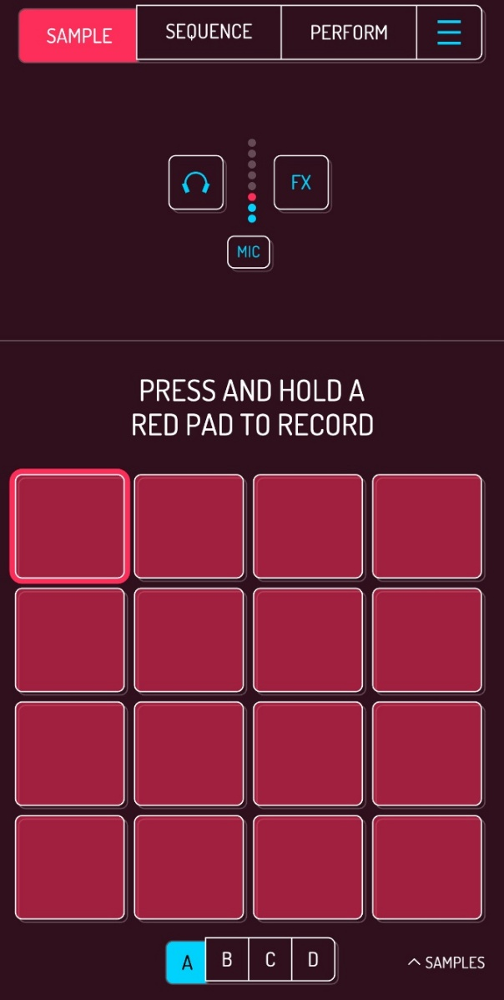


Pracujemy w Koala Sampler! W tym zadaniu nagramy własne sample, czyli dźwięki, które posłużą nam do stworzenia pierwszego własnego utworu muzycznego.


Więcej o samej aplikacji i jej funkcjach dowiesz się z poprzedniej karty: [Koala Sampler](../01-get-the-app/).

## Krok 1: Włączenie nagrywania

Kliknij i przytrzymaj wybrany pad (czerwony kwadracik), aby włączyć nagrywanie przez mikrofon urządzenia.

## Krok 2: Nagranie pierwszego sampla

Nagraj jeden wybrany krótki dźwięk z otoczenia. Może to być na przykład:
* klaśnięcie dłońmi,
* stuknięcie palcem w stół,
* dowolny śmieszny dźwięk wydany paszczą.

Twój dźwięk automatycznie zapisze się pod wybranym padem.

## Krok 3: Odsłuchanie nagrania

Dotknij tego samego pada jeszcze raz (tym razem krótko) – posłuchaj swojego pierwszego sampla!

---

## Mini zadanie

Używając kolejnych pustych padów, nagraj:
1. Jeden dźwięk **cichy**,
2. Jeden dźwięk **głośny**,
3. Jeden **bardzo dziwny** dźwięk.

Po wykonaniu tego zadania będziesz mieć nagrane sample pod każdym padem w górnym rzędzie.

---


**Wskazówka:** Najlepsze sample na start są krótkie, wyraźne i dynamiczne!

