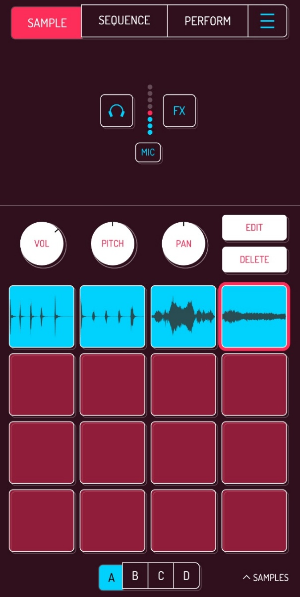


Pracujemy w Koala Sampler! W tym zadaniu wykorzystamy nagrane wcześniej sample, aby stworzyć pierwszy własny bit, czyli prosty rytm będący podstawą utworu muzycznego.


Jeśli nie masz jeszcze własnych sampli, wróć do poprzedniej karty: [Nagrywamy dźwięki](../02-record-sounds/).

## Krok 1: Odtwarzanie sampli

Dotykaj kolejnych padów i sprawdź, jak brzmi każdy z nich.

Posłuchaj, które dźwięki do siebie pasują.

## Krok 2: Tworzenie rytmu

Spróbuj odtwarzać sample jeden po drugim.

Na przykład:

* klaśnięcie
* stuknięcie
* klaśnięcie
* dźwięk głosu

Powtórz tę sekwencję kilka razy, aż będziesz zadowolony z efektu.

## Krok 3: Znajdź swój rytm

Zmieniając kolejność sampli, spróbuj stworzyć rytm, który najbardziej Ci się podoba.

Nie ma jednej poprawnej odpowiedzi – eksperymentuj i baw się dźwiękami!

---

## Mini zadanie

Stwórz własny bit, wykorzystując przynajmniej 3 różne sample.

Gdy znajdziesz rytm, który Ci się podoba, przejdź do kolejnej karty: [Nagrywamy nasz bit](../04-record-your-beat/).

---


**Wskazówka:** Zmiana kolejności sampli może całkowicie zmienić brzmienie Twojego bitu.

