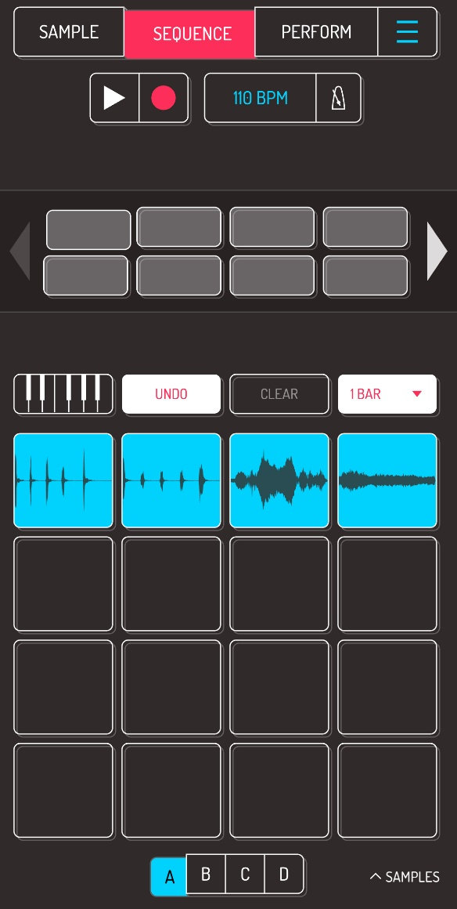


Pracujemy w Koala Sampler! W poprzedniej karcie stworzyliśmy własny bit – rytm. Teraz zapiszemy go jako nagranie.


Jeśli nie masz jeszcze swojego rytmu, wróć do poprzedniej karty: [Tworzymy pierwszy bit](../03-create-first-beat/).

## Krok 1: Przejście do zakładki Sequence

Kliknij przycisk **Sequence** znajdujący się na górze ekranu – to tutaj będziemy tworzyć i nagrywać nasze rytmy.

## Krok 2: Włączenie nagrywania

Naciśnij przycisk **Record** (to ta czerwona kropka pod napisem Sequence) i zagraj swój rytm na padach.

Możesz zacząć od prostego rytmu składającego się z kilku dźwięków.

Jeśli chcesz zakończyć nagrywanie, naciśnij jeszcze raz przycisk **Record**. Jeśli chcesz odtworzyć nagrany bit i posłuchać efektu, naciśnij przycisk **Play** (to ten biały trójkąt obok kropki).

---

## Mini zadanie

Nadaj swojemu bitowi tytuł. Jak będzie się nazywał Twój pierwszy utwór?

---


**Wskazówka:** Przed rozpoczęciem nagrywania poćwicz swój rytm kilka razy.

